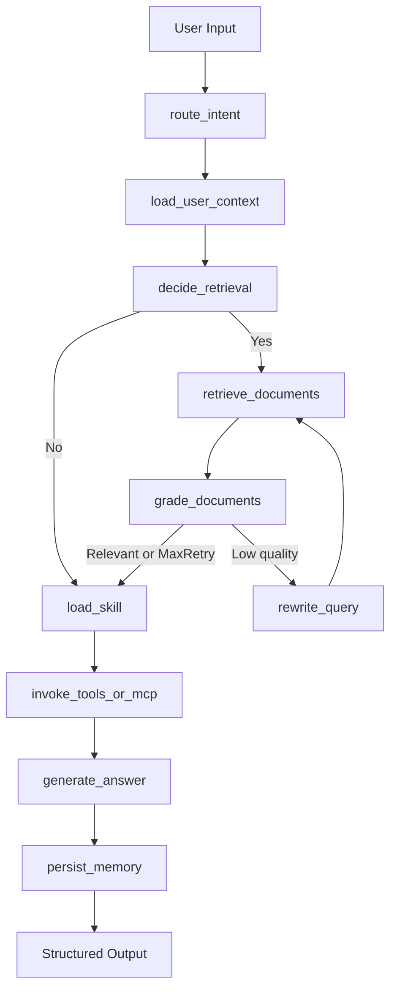

# Enterprise Knowledge & Action Agent (LangChain + LangGraph)

A production-style portfolio project for enterprise knowledge Q&A and lightweight automation.
It is **not** a generic chatbot. The workflow is centered on enterprise tasks:
- knowledge/policy Q&A,
- meeting summarization,
- safe SQL suggestion,
- user preference memory,
- MCP read-only resource/tool integration,
- trace + eval for regression.

## Core Capabilities
- **LangChain v1 `create_agent`** as base agent loop.
- **LangGraph** for orchestration, state, retry loop, thread memory, and persistence.
- **Agentic RAG**: retrieval gating, doc grading, query rewrite retry, citation output.
- **Skills progressive disclosure**: load full `SKILL.md` only when needed.
- **Memory**:
  - short-term: thread-scoped graph checkpoint and recent message summary.
  - long-term: structured JSON store for user preferences, term mappings, task summaries.
- **MCP integration**:
  - optional external MCP server via `langchain-mcp-adapters`.
  - safe fallback resource/tool path for local demo.
- **LangSmith tracing** integration.
- **Baseline evals** with 20 cases and metric summary.

## Architecture


## Repository Structure
```text
app/
  graph.py
  state.py
  config.py
  prompts.py
  tools.py
  main.py
  rag/
  skills/
  memory/
  mcp/
data/
  knowledge_base/
  memory_store/
  mcp_stub/
evals/
  dataset.jsonl
  rubrics.md
  run_eval.py
tests/
scripts/
.env.example
langgraph.json
pyproject.toml
requirements.txt
README.md
PROJECT_SUMMARY.md
```

## Environment Variables
Copy `.env.example` to `.env` and fill at least OpenAI keys.

```bash
OPENAI_API_KEY=
OPENAI_BASE_URL=
OPENAI_MODEL=gpt-4.1-mini
OPENAI_EMBEDDING_MODEL=text-embedding-3-small
FORCE_LOCAL_FALLBACK=false
LANGSMITH_TRACING=true
LANGSMITH_PROJECT=enterprise-agent
LANGSMITH_API_KEY=
MCP_SERVER_NAME=filesystem
MCP_SERVER_COMMAND=
MCP_SERVER_ARGS=
```

## Quick Start
### Option A: uv (recommended)
```bash
uv sync
uv run python scripts/ingest_docs.py
uv run python -m app.main --interactive --user-id demo_user --thread-id demo_thread
uv run pytest -q
uv run python evals/run_eval.py
```

### Option B: venv + pip
```bash
python -m venv .venv
# Windows
.\.venv\Scripts\activate
pip install -e .
```

### 1) Ingest Knowledge Base
```bash
python scripts/ingest_docs.py
```

### 2) Run CLI
```bash
python -m app.main --interactive --user-id demo_user --thread-id demo_thread
```

### 3) Single Query
```bash
python -m app.main "差旅报销发票丢了怎么办？" --user-id u1 --thread-id t1
```

## Demo Scenarios
1. **Knowledge Q&A**
- Input: `差旅打车发票丢了还能报销吗？`
- Expected: retrieval + citations from policy docs.

2. **Skill Call (SQL)**
- Input: `根据 sales_orders 生成 2026年3月华南 GMV SQL`
- Expected: load `sql_analysis` skill and return read-only SQL draft.

3. **Memory**
- Turn 1: `以后尽量用中文，回答简洁`
- Turn 2 (same user): ask another question and see preference preserved.

4. **MCP**
- Input: `读取 mcp://enterprise/sales_schema 并说明字段`
- Expected: MCP resource path is available and merged into final response.

## Evaluation
Run baseline eval:
```bash
python evals/run_eval.py
```

It outputs:
- `answer_correct`
- `citation_present`
- `expected_skill_selected`
- `expected_tool_path`
- report file: `evals/latest_report.json`

### Sample Result Table (template)
| metric | value |
|---|---|
| answer_correct | 0.70 |
| citation_present | 0.85 |
| expected_skill_selected | 0.90 |
| expected_tool_path | 0.75 |
| overall | 0.80 |

## Switching Components
- **Model**: update `OPENAI_MODEL` in `.env`.
- **Provider Endpoint**: update `OPENAI_BASE_URL` when using OpenAI-compatible providers.
- **Fallback Mode**: set `FORCE_LOCAL_FALLBACK=true` to run fully offline deterministic flow.
- **Embeddings**: update `OPENAI_EMBEDDING_MODEL`.
- **Vector store**: replace `langchain_chroma.Chroma` in `app/rag/retriever.py` and `app/rag/ingest.py`.
- **MCP server**: set `MCP_SERVER_COMMAND` + `MCP_SERVER_ARGS`; adapter loads tools automatically.

## Safety Boundaries
- Read-only tool design by default.
- SQL skill outputs **suggested SELECT SQL only**.
- No destructive operations.

## Known Limitations
- External MCP tool execution currently has fallback mode if no live MCP server is configured.
- Retrieval grading is heuristic; no reranker model yet.
- Eval `answer_correct` is keyword-based baseline.

## TODO (explicit)
- TODO: Add full async MCP tool invocation execution path (not only fallback payload).
- TODO: Expose this project as an MCP server endpoint for other agents.
- TODO: Upgrade eval to LLM-as-judge + human spot-check.

## Resume Description
### Chinese
**项目名称：企业知识库与自动化 Agent（LangChain + LangGraph）**
- 基于 LangChain `create_agent` 与 LangGraph 构建企业知识库 Agent，实现任务路由、工具调用、状态化执行与可追踪工作流。
- 设计 Agentic RAG 流程，支持检索决策、查询改写、文档相关性打分和带引用问答。
- 实现 `SKILL.md` 按需加载机制，并结合短期/长期记忆维护用户偏好与历史上下文。
- 通过 MCP 接入外部只读能力，结合 LangSmith tracing 与 20 条评测集实现可回归验证。

### English
**Enterprise Knowledge & Action Agent (LangChain + LangGraph)**
- Built a stateful enterprise agent using LangChain `create_agent` and LangGraph for routing, tool use, and traceable workflow orchestration.
- Implemented agentic RAG with retrieval gating, query rewrite retries, relevance grading, and citation-backed responses.
- Added progressive skill loading via `SKILL.md`, plus short-term and long-term memory for preference and context continuity.
- Integrated MCP read-only capability and LangSmith-based tracing/evals for observability and regression testing.

## How To Explain In Interview (30s)
This project demonstrates a practical single-agent architecture where LangChain handles tool-enabled reasoning, while LangGraph controls deterministic workflow, retries, and persistence. It combines agentic RAG, on-demand skills, memory, and MCP integration in one enterprise scenario, then validates behavior with trace + eval datasets.
